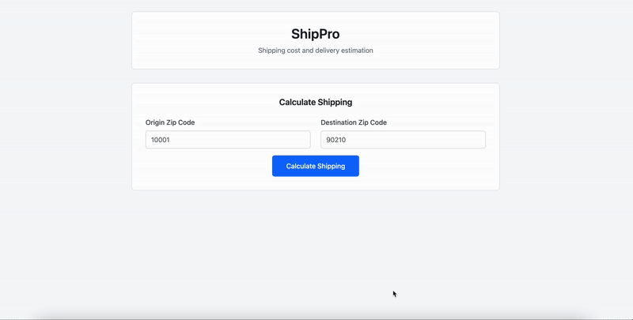

# ShipPro - Simple Shipping Calculator

A minimalistic Flask application for calculating shipping estimates across the United States.

## Features

- Calculate shipping costs and delivery times between US zip codes
- Simple web interface for easy use
- REST API for programmatic access
- Fast distance calculations using the Haversine formula

## Project Structure

```
ShipPro/
├── app.py                 # Main Flask application
├── config.py             # Simple configuration
├── requirements.txt      # Core dependencies
├── models/
│   └── shipping.py       # Shipping calculation logic
├── templates/
│   └── index.html        # Web interface
└── Data/
    └── uszips.csv        # US zip code database
```
## Demo

<div align="center">
  
  <p><em>ShipPro in action - from zip code input to instant shipping estimates</em></p>
</div>

## Installation

1. Install dependencies:
```bash
pip install -r requirements.txt
```

2. Run the application:
```bash
python app.py
```

3. Open http://localhost:5000 in your browser

## API Usage

**Calculate Shipping** - `POST /api/calculate`

```json
{
    "origin": "10001",
    "destination": "90210"
}
```

**Response:**
```json
{
    "distance_miles": 2445.8,
    "estimates": [
        {
            "service_name": "Priority Express",
            "delivery_date": "January 15, 2025",
            "delivery_days": 2,
            "cost": 45.99,
            "confidence": 92
        }
    ]
}
```

## Health Check

`GET /health` - Returns application status

## Production Deployment

For production, use a WSGI server like Gunicorn:

```bash
pip install gunicorn
gunicorn app:app
```

## Configuration

Set environment variables:
- `FLASK_ENV` - development or production
- `SECRET_KEY` - for production security
- `HOST` - server host (default: 0.0.0.0)
- `PORT` - server port (default: 5000)
- `ZIP_DATA_PATH` - path to zip code data (default: Data/uszips.csv)

## Data Sources

- **US Zip Codes Database**: [SimpleMaps.com US Zips](https://simplemaps.com/data/us-zips) - Comprehensive database of US zip codes with latitude/longitude coordinates used for distance calculations and shipping estimates. 
